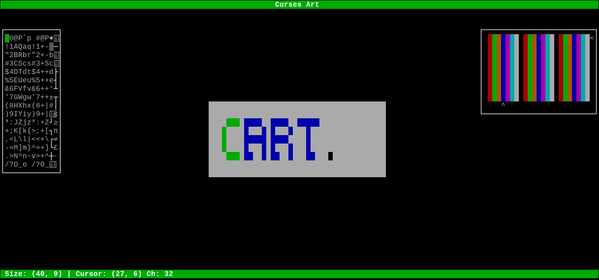

# curses-art
*A ncurses based ascii-art editor*

---



---

#### Dependences
The only dep is ncurses 5.0 or higher.

---
#### Compile and Run
Compile:
```sh
$ make
```
Run:
```sh
$ ./bin/cursesart file
```

#### Keys
* **i, j, k, l:** move the cursor through the sheet.
* **Space:** print the current character with the current attribute.
* **Delete, x:** delete the current character at cursor position.
* **w, a, s, d:** Move the character selector on the left toolbar.
* **Up, down, left, right arrows:** move the color/attribute selector on the right  toolbar.
* **I, J, K, L:** move the sheet.
* **c:** center the sheet.
* **v:** show / hide sheet background.
* **F2:** save the file and generates C source.
---
#### Command line
```sh
$ cursesart FILE -w -h -H
```
* **FILE:** (required) name of the file to edit.
* **-w, --width:** width of the sheet.
* **-h, --height:** height of the sheet.
* **-H, --help:** Show quick cmd line help.

#### Saving the file
Press F2 to save the file. curses-art generates a binary file to be reopened later. Also generates a source C language file to export to any ncurses project.